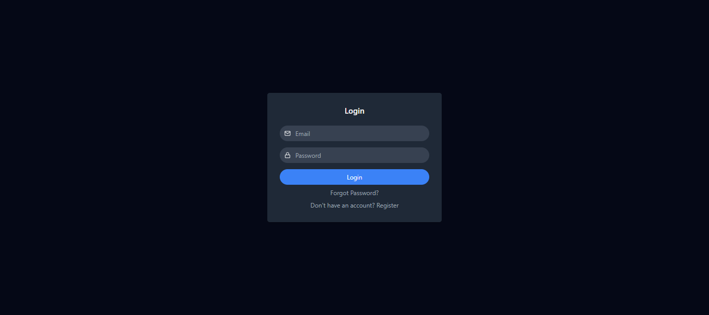
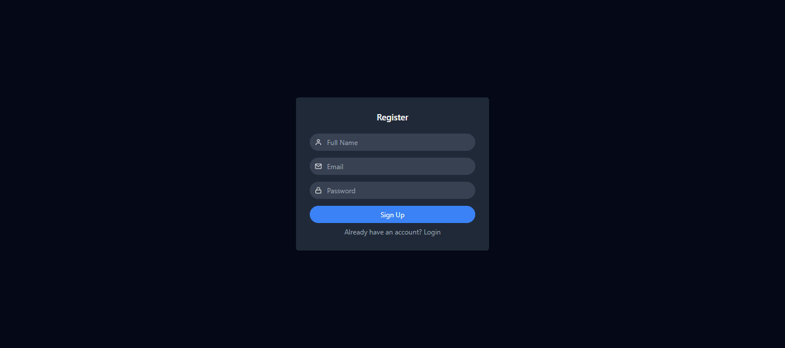
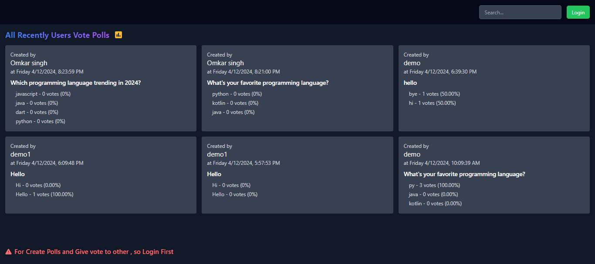
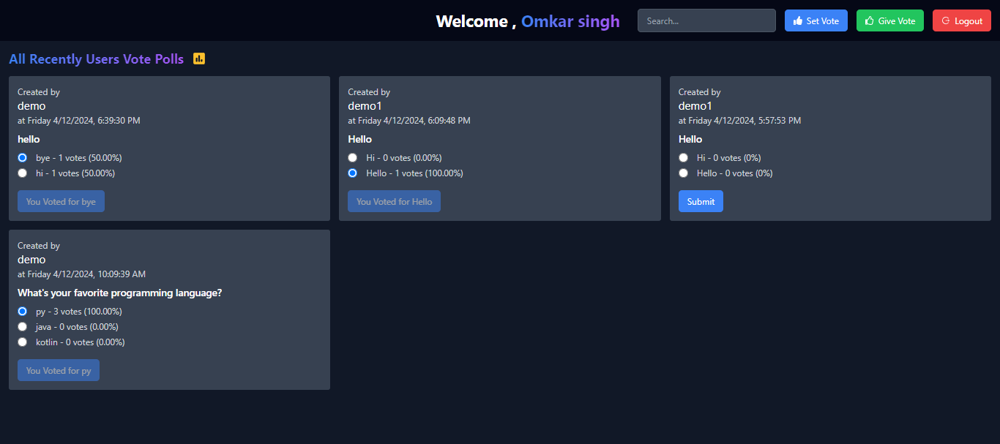
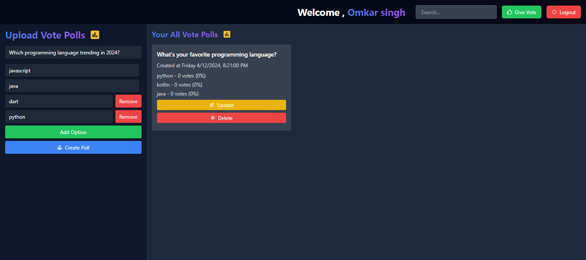
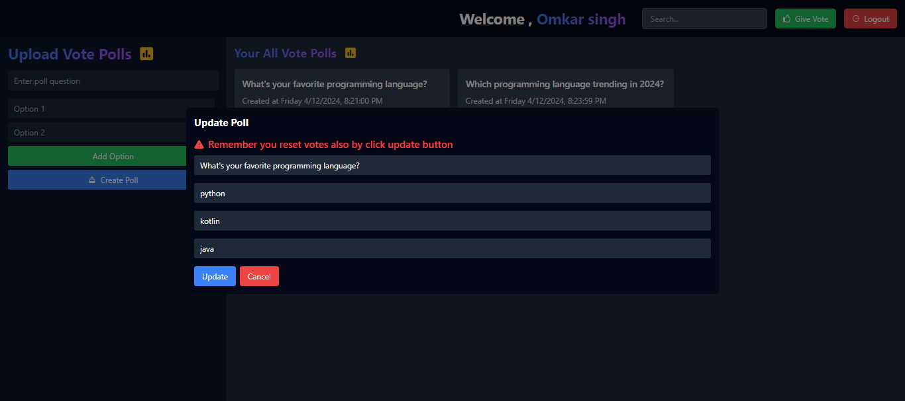
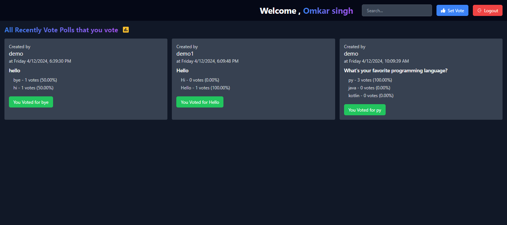

# Vote

VoteSystem is a full-stack web application designed to empower users to create, participate in, and manage polls and votes seamlessly. With a user-friendly interface built using Next.js and Tailwind CSS, users can effortlessly navigate through the platform to create new polls, cast their votes, and explore existing polls.

## Features

- Poll Creation: Users can easily create new polls, specifying the question and available options.
- Voting: Seamless and intuitive interface for users to cast their votes on existing polls.
- Search and Filter: Efficient search and filtering functionalities allow users to quickly find polls based on keywords or categories
- Responsive Design: The frontend is designed using Next.js and Tailwind CSS, ensuring a responsive and visually appealing experience across devices.
- Secure Backend: The backend is powered by Node.js and Firebase, providing a robust and secure infrastructure for data storage and retrieval.

## Deployment
https://vote-omkarsingh.vercel.app

## Installation
Run command in Root path

Install all packages

```bash
  npm i 
```
Run project 

```bash
  npm run dev
```
## Screenshots
login 


register


home before login
   

home after login


create polls


update polls


history of vote you give to polls

